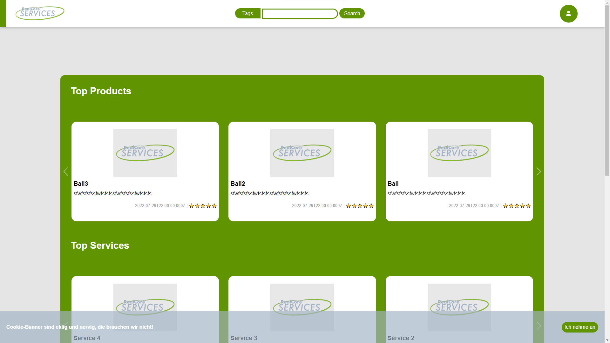

# RealBay Services

<!-- ABOUT THE PROJECT -->
# About The Project



Everyone knows the problem when the tea is empty again and the way to the trainees is too long to force them to change it.
For this case we have developed 'RealBay Services', the site for in-house services, bets and products.
Already implemented are:

* Database 
* API 
* Frontend with sample data
* Find user profiles via searchbar

<!-- API -->
# API

The RealBay Services API grants GET access to user data relevant to public profiles and all services, products and bets offered.

## Item 
following paths start with */item/...*

<hr>

- All public data of an item

**Syntax**
```
/:id
```
**Parameters**
| Parameter | Possible values | Description |
| ------------- | ------------- | ------------- |
| id | any integer | id of the user whose data you will receive |

<hr>

- Get items from categories

**Syntax**
```
/recommendations/:category/:amount/:minID/:maxID/:order
```
**Parameters**
| Parameter | Possible values | Description |
| ------------- | ------------- | ------------- |
| category | foreach, ignore, service, product, bet | get them for each category, get items and ignore the category, get items only from specific category |
| amount | any integer | amount of items to get for each selected category |
| minID | ignore, any integer | minimal id of the items to select |
| maxID | ignore, any integer | maximal id of the items to select |
| order | desc, asc | descending  or ascending  order |

<hr>

- Get an array of items (with all public data) which have similar names

**Syntax**
```
/search/:name/limit
```
**Parameters**
| Parameter | Possible values | Description |
| ------------- | ------------- | ------------- |
| name | any string | string to search for in item names |
| limit | any integer | maximum amount of users to return |


<!-- Roadmap -->
# Roadmap

1. add settings to the frontend
2. tags dropdown menu
3. login
